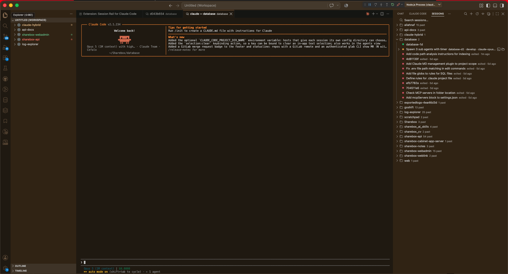

<p align="center">
  
</p>

<h1 align="center">Session Rail</h1>

<p align="center">
  <a href="https://marketplace.visualstudio.com/items?itemName=AliAhnaf.session-rail"></a>
  <a href="https://marketplace.visualstudio.com/items?itemName=AliAhnaf.session-rail"></a>
  <a href="https://marketplace.visualstudio.com/items?itemName=AliAhnaf.session-rail&ssr=false#review-details"></a>
  <a href="LICENSE"></a>
  
  
</p>

Session Rail shows every Claude Code session running on your machine as a nested
sidebar tree in VS Code — project, session, subagent, task — so you can see what
every `claude` process is doing without hunting through terminal tabs.

It is a handy tool for both halves of the way people work with Claude Code today.
If you lean on multi-agent orchestration and write little code by hand, Session
Rail is the control tower: every session, every nested subagent, every task, in
one tree you can watch and steer. If you have no
interest in living inside a prompt, you keep coding in
your editor while a glance at the sidebar tells you which sessions are running,
which are generating, and which are done, with a click to jump into any of them.
Same tool, both worlds.



## Demo

<video src="https://github.com/ali-ahnaf/session-rail/raw/main/media/demo.mp4" controls muted playsinline width="900"></video>

[Watch the demo](https://github.com/ali-ahnaf/session-rail/raw/main/media/demo.mp4) — the tree filling in as sessions start, a subagent nesting under its parent, and a click jumping into a running session.

## Quick start

1. **Install**

   From a local build of this repo:

   ```bash
   npm install && npm run package
   ```

   Or, once it is published to the Marketplace:

   ```bash
   code --install-extension AliAhnaf.session-rail
   ```

2. **Open the view** — click **Sessions** in the Activity Bar (the rail icon).
3. **Wait a beat.** Nothing to configure. Any `claude` running anywhere on the
   machine — in VS Code, in iTerm, over SSH — appears within one poll interval
   (2 s by default). A brand-new session shows up once it has registered itself
   under `~/.claude`, so give it a second or two.

## What you see

The tree has four levels:

- **Project** — a working directory (or git root, per `sessionRail.groupBy`) with
  one or more sessions. Pinned ones are lifted into a **Pinned** section at the
  top — see [Pinned folders](#pinned-folders).
- **Session** — one `claude` process, live or past.
- **Subagent** — a Task/Agent-tool invocation, nested under whatever spawned it,
  to any depth.
- **Task** — one to-do item from the session's todo list, when it has one and
  `sessionRail.showTasks` is on.

### Reading a row

Every row packs its detail into the greyed-out text after the label. Hover for a
full tooltip (session id, pid, cwd, entrypoint, Claude Code version, agent task
description).

| Row | Label | Grey description |
| --- | --- | --- |
| Project | folder name | number of **live** sessions, `4 past` when none are running, or `no sessions` for a pinned folder with nothing in the tree |
| Pinned (section) | `Pinned` | how many folders are pinned |
| Session (live) | Claude Code's own session title, or its derived name until a title exists | `name · branch · model · effort · timer` — timer is the elapsed run time while generating, `idle 04:12` otherwise |
| Session (past) | same | `exited · 3d ago` |
| Subagent | agent type, plugin prefix stripped | `d2` (spawn depth) plus its run time once finished |
| Task | the to-do subject | `done` when completed |

Fields that Claude Code did not write are simply absent — a session with no
branch shows no branch.

### Icons and colors

| Icon | Meaning |
| --- | --- |
| 🟢 filled circle | session is live and idle |
| 🟠 filled circle | session or subagent is generating right now |
| 🔴 filled circle | session has exited |
| ✓ check | subagent finished |
| ○ / 🕐 / ✓ | task pending / in progress / completed |

Colors are themeable: `sessionRail.live`, `sessionRail.working`,
`sessionRail.exited`, `sessionRail.waiting`. They are semantic, not branding.
`sessionRail.waiting` is **reserved** — a waiting state is not derivable from
disk, so no row is currently colored with it.

## Actions

**Click a session row** → **Open Terminal**.

**Inline icons** (hover a row, right end):

| Icon | On | Does |
| --- | --- | --- |
| `+` | project | starts a new `claude` in that directory |
| pin / pinned | project | Pin Folder / Unpin Folder |
| terminal | any session | Open Terminal |
| output | past sessions | opens the transcript viewer |
| folder-opened | project, session | Show in Explorer |

**Right-click menu** adds, per row type:

- **Open Transcript** — also available here for *live* sessions and for
  subagents, which have no inline icon for it.
- **Reveal Working Folder** — opens the folder in Finder/your file manager. A
  different action from Show in Explorer; deliberately menu-only.
- **Copy Session ID**.
- **Pin Folder** / **Unpin Folder** — project rows; see
  [Pinned folders](#pinned-folders).
- **Stop Session** — SIGTERM, behind a modal confirm. Live rows only.

**View title bar**: search · clear search (appears only while a search is
active) · `+` new session in this window's folder (it asks which one in a
multi-root workspace, and falls back to your home directory when no folder is
open) · refresh · show/hide exited (one toggle, two icons, so the icon shows the
current state).

## Opening a session that is running somewhere else

Two processes cannot share one transcript — that corrupts it. So when you click a
live session whose terminal this window cannot see, Session Rail asks first:

- **Move here** — stops that process (SIGTERM) and resumes the session in a new
  terminal here. Same session id, same row. Anything it had not written to disk
  is lost.
- **Fork instead** — leaves it running and continues the conversation under a
  **new** session id, which shows up as a second row.

Set `sessionRail.openLiveSession` to `adopt` or `fork` to skip the prompt. A
session already hosted in this window is simply focused; an exited session always
resumes in place with no prompt.

## Pinned folders

**Pin Folder** (the pin icon on any project row) lifts that folder into a
**Pinned** accordion at the top of the tree. Unpin from the same spot.

- Pinned folders keep the order you pinned them in — the section does not
  reshuffle itself when a session starts somewhere.
- **A pin outlives its sessions.** Pin a folder and it stays listed even with
  nothing running in it, showing `no sessions`, with its `+` ready to start one.
  That is the point: it is a shortcut to the folders you work in.
- Collapse the section and it stays collapsed.
- Pins live in the extension's own storage, per machine — they are not a setting,
  so they are never synced to another machine, where the paths would mean
  nothing.
- A pinned folder that no longer exists still shows; starting a session in it
  tells you it is gone.

## Searching

Click the **Search sessions…** row at the top of the tree, or the magnifier in
the view title. The tree filters as you type, matching the session title (or its
name when it has no title yet).

- Escape restores whatever was active before you opened the box.
- Emptying the box clears the filter.
- The search row shows the match count, and survives at zero matches — an empty
  tree would look like the machine has no sessions at all.
- `no matches · exited hidden` means the query only searched live sessions. Turn
  on **Show Exited Sessions** to widen it.

The query is transient: it dies with the window and is never written to settings.

## Past sessions

Turn on `sessionRail.showExited` to include sessions that are no longer running,
and `sessionRail.historyDays` (7 by default) to say how far back to look.

Two things worth knowing:

- **History comes from transcripts, not from the session registry** — the
  registry only tracks live processes. So history rows are deliberately shallow:
  no subagents, no tasks, no branch/model/effort. They keep their title, their
  age, and their transcript.
- **An empty exited list is not a broken toggle.** Depending on the Claude Code
  version, session records may be cleaned up the moment a process exits, and any
  transcript older than `historyDays` is out of scope.

## Transcript viewer

**Open Transcript** opens a read-only webview of the conversation: user turns,
assistant turns, tool calls and results. It shows the **last 512 KB** of the
transcript (they reach many megabytes) and has a **Reload** button to pull in
whatever has been appended since.

## Status bar

One item on the left summarizes the machine: `3 live`, or a spinner and
`1 generating` when something is producing output, plus `· 2 agents` when
subagents are running. Hover for a per-project breakdown; click to reveal the
view. It hides itself when nothing is live.

## Settings

| Setting | Type | Default | Description |
| --- | --- | --- | --- |
| `sessionRail.refreshInterval` | number (500–30000) | `2000` | How often to poll `~/.claude` for changes, in milliseconds. Lower values cost more CPU. |
| `sessionRail.showTasks` | boolean | `true` | Show task nodes under a session or subagent that has a todo list. |
| `sessionRail.showExited` | boolean | `false` | Show sessions that have exited. Their transcripts survive, so they can still be opened for review. |
| `sessionRail.historyDays` | number (0–90) | `7` | Days of past sessions to recover from transcripts when exited sessions are shown. `0` shows only what the session registry still knows about. |
| `sessionRail.groupBy` | `cwd` \| `gitRoot` | `"cwd"` | Group projects by working directory, or by git repository root (folding subdirectory sessions into their repo). |
| `sessionRail.terminalLocation` | `editor` \| `panel` | `"editor"` | Where a terminal that Session Rail opens appears. A session already running in this window is focused where it is. |
| `sessionRail.openLiveSession` | `ask` \| `adopt` \| `fork` | `"ask"` | What to do when you open a session that is live in a terminal this window cannot see. `adopt` stops it and resumes under the same id; `fork` leaves it alone and continues under a new id. |
| `sessionRail.claudeHome` | string | `""` | Overrides the location of `~/.claude`. Mainly for testing; leave empty for the default. |

## Troubleshooting

**The tree is empty but `claude` is running.** A session registers itself under
`~/.claude` shortly after start — press **Refresh**. If it still does not appear,
run `Session Rail: Show Log` and check for read errors; a nonstandard
`CLAUDE_CONFIG_DIR` needs `sessionRail.claudeHome` pointed at it.

**Clicking a session opens a new terminal instead of focusing the old one.**
Terminal linking walks process ancestry with `ps`, which is POSIX-only. On
Windows you get a "started elsewhere" notice and a resume instead.

**Rows look wrong after upgrading Claude Code.** `~/.claude` is private,
unversioned state with no compatibility guarantee. Its shape does change between
releases, and Session Rail may show stale or partial data until it is updated to
match. Please open an issue with the version.

## What it writes

Nothing under `~/.claude` — no writes, no moves, no deletes. The one thing it
stores is your list of pinned folders, in VS Code's own per-machine extension
storage. Three actions have effects outside it, all user-initiated:

- **Stop Session** sends SIGTERM to the session's process (modal confirm first).
- **New Session Here** / **New Session in Workspace Folder** open a terminal and
  run `claude` in it — that process writes its own state, as any session does.
- **Show in Explorer** appends a workspace folder, which VS Code persists to your
  `.code-workspace` (or an untitled workspace). It is **add-only** — it never
  removes a root you arranged by hand, and it asks first for your home directory
  or the filesystem root.

---

## Development

```bash
npm install
npm run watch
```

Then press <kbd>F5</kbd> in VS Code to launch an Extension Development Host with
Session Rail loaded. If F5 does not work:

```bash
# for macOS, adjust the path to your VS Code installation:
"/Applications/Visual Studio Code.app/Contents/Resources/app/bin/code" \
  --extensionDevelopmentPath="$PWD" --new-window
```

Other scripts: `npm run build` (production bundle), `npm run typecheck`,
`npm run lint`, `npm run package` (`.vsix`).

`CLAUDE.md` documents the architecture, the frozen contracts, and the invariants
worth not breaking.
